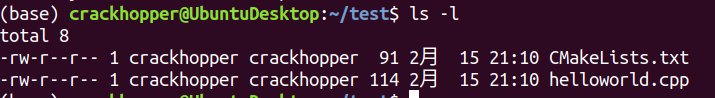
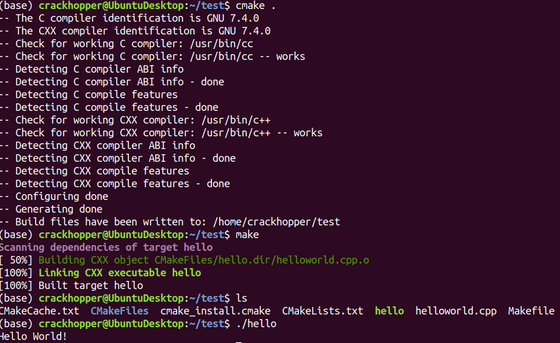
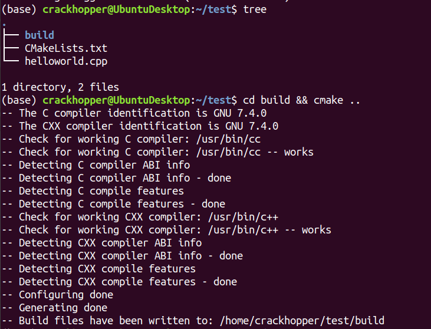
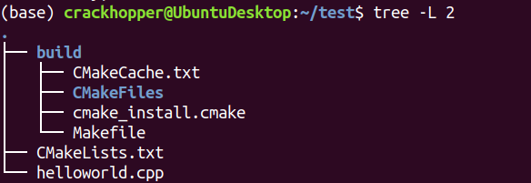
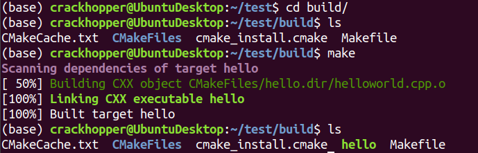
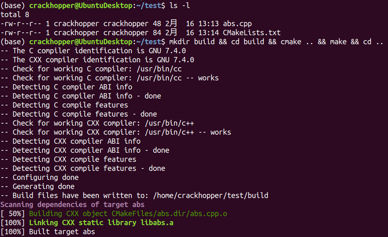
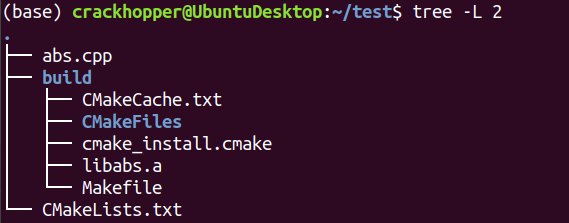
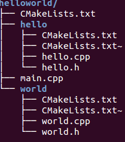
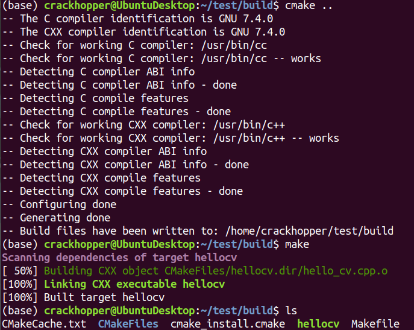
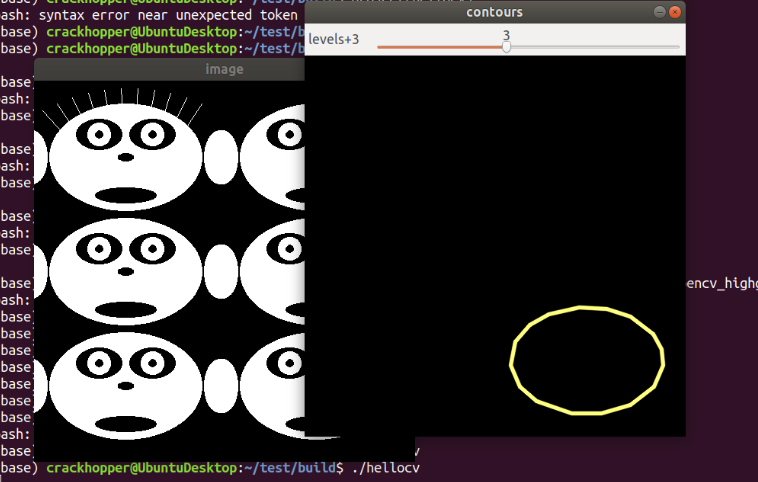

# 简介
CMake是一个主要用来管理C++项目的工具。主要特点是：更好的解决C++项目跨平台编译带
来的配置问题。

CMake提供很多实用的功能，本文简单介绍我项目里常用的一些特性。

如何安装CMake这里就不介绍了，可以自行搜索。安装好后要确保在命令行可以执行cmake命
令。

# 编译一个可执行文件

## Hello World项目
CMake通过找寻目录下的 `CMakeLists.txt` 文件，读取文件里的内容对项目进行构建。使
用方式是

```sh
cmake <project_dir>
```

其中 `<project_dir>` 是 `CMakeLists.txt` 所在的文件夹。cmake的工作流程如下：
1. cmake读取 `<project_dir>` 文件夹下面的 `CMakeLists.txt` 文件。
2. 执行平台解析，基础库解析，依赖库查找。如果有错误则暴露错误，如果成功则生成一
   系列用来构建的文件。其中最重要的一个文件叫 `Makefile` 。
3. 用户通过执行 make ，读取  `Makefile` 对项目进行构建。

### 简单的例子
看一个简单的例子，目录层级如下：



其中，两个文件的内容：

**helloworld.cpp**
```cpp
#include<iostream>
int main(int argc, char *argv[]){
   std::cout << "Hello World!" << std::endl;
   return 0;
}
```

**CMakeLists**
```cmake
cmake_minimum_required(VERSION 2.8.9)
project (hello)
add_executable(hello helloworld.cpp)

```

这里解释一下 `CMakeLists.txt` 的内容。
- 第1行指定最低的cmake版本
- 第2行指定项目名称
- 第3方添加一个任务，生成可执行文件 `hello` 。生成这个文件需要用到
  `helloworld.cpp` 。
- cmake不区分命令的大小写 。

### 构建helloworld


解释一下： 
- `cmake .` 运行cmake命令，查找目录为 `.` (即当前目录) 。这个命令会生成一系列文
  件。包括一个重要的 `Makefile` 文件
- `make` 会在当前文件夹查找 `Makefile` 文件 ，然后对项目进行编译，最终产生了二进
  制 `hello`
- `./hello` 运行这个编译好的二进制文件

## 项目外构建
cmake提供了一个非常好用的特性，就是 **项目外构建** 。简单来说，cmake支持在自定义
的位置对项目进行构建。这样就避免了构建时生成的临时文件把原本的项目弄的非常混乱。

比如说刚才的例子，我们在项目里创建一个build文件夹，在里面构建。



构建好了之后:


我们可以看到生成的文件都在build文件夹中。进入到里面，进行make即可编译。




# 编译一个静态库文件
## 静态库机制
说静态库首先要说什么是编译。

编译就是把 **源代码** 转化为 **目标代码** 的过程。而什么是 **目标代码** 呢？就是
机器可以执行的二进制代码，一般来说都是要符合某种规范的，比如linux下的elf格式，
windows下的pe格式。这里就不细展开了。

有的代码具备很强的通用性，比如计算绝对值的函数。我们希望在多个项目里都使用这个函
数。那么一个方式就是把你的源代码编译成库文件 （也是一种二进制格式），当你写程序
需要的时候，链接器可以 **链接** 到这个库文件中，找到对应函数的二进制，“注入”到你
写的程序中。

因此我们通常常见的项目构建都分两步：编译、链接。
- 编译：负责源代码转换为目标代码
- 链接：负责找到程序的入口（main函数），并把二进制组装起来，生成可执行格式（elf
  或pe）

那么如何把代码构建成一个静态库呢？

## 静态库项目
我们先看一下 `CMakeLists.txt` 的写法：

```cmake
cmake_minimum_required(VERSION 2.8)

project(abs)

add_library(abs STATIC abs.cpp)
```

对应的cpp文件如下
```cpp
double abs(double v){
  return v>0 ? v : -v;
}
```
我们尝试构建一下：


构建后的结果：


注意到，libabs.a文件，即为我们构造出的静态库文件。

# 编译一个动态库文件

## 动态库机制
静态库引入代码复用的能力后，有一个新的问题出现了：比如abs代码，在多个程序里都有
使用，而且这多个程序可能都在系统上执行，这样abs的代码就被系统内存加载了多次。这
无疑是一种浪费。

动态库提供了一种机制：库的代码并不会“注入”到编译产出的二进制文件中，而是由操作系
统加载对应的库，在程序加载到内存的过程中，操作系统自动把对应的动态库调用进行重定
向。这样abs的代码只会在内存中出现一次。

动态库技术是一个非常广泛使用的技术，操作系统大部分的api都是通过动态库提供的。

构建动态库和构建静态库一样简单。我们看一下例子：

## 动态库项目
延用静态库的例子，我们只需要把 `CMakeLists.txt` 修改一下即可。
```cmake
cmake_minimum_required(VERSION 2.8)

project(abs)

add_library(abs SHARED abs.cpp)
```
构造的结果会产生一个 `libabs.so` 文件。读者可以自行尝试一下。

如果要同时构建静态库和动态库，cmake的写法需要一点技巧：
```cmake
cmake_minimum_required(VERSION 2.8)
project(abs)
add_library(abs SHARED abs.cpp)
add_library(abs_static STATIC abs.cpp)
set_target_properties(abs_static PROPERTIES OUTPUT_NAME "abs")
```
这是因为cmake中不允许target有相同的名字，所以我们需要用不同的名字，同时修改target的输出。

# 引入库文件
## 引入子模块

使用 `add_subdirectory` 函数，可以把子文件夹中的 `CMakeLists.txt` 引入到当前
`CMakeLists.txt` 中。

举个例子：
```cmake
cmake_minimum_required(VERSION 2.8)
project(helloworld)

include_directories(./ ./hello ./world)#添加多目录的路径
# Add block directories
add_subdirectory(hello)#添加hello文件夹中的hello库
add_subdirectory(world)#添加world文件夹中的world库

add_executable(helloworld main.cpp)
#将多目录下的hello库和world库链接上可执行文件
target_link_libraries(helloworld hello world)
```

解释：
- `add_subdirectory` 会把对应文件夹中的 `CMakeLists.txt` 引入进来，包括内部的
  target。这里假定了 `hello` 文件夹的target是 `hello` ， 这里假定了 `world` 文件
  夹的target是 `world` 。
- `target_link_libraries` 用来对 `helloworld` 这个target进行更多的描述：描述这个
  target完成过程中，需要对 `hello` 以及 `world` 两个target进行链接（这两个target
  必须是库）

完整的目录结构：


## 引入第三方库

由于大量开源模块都是使用cmake进行构建的，因此存在大量的开源脚本方便你快速把第三
方库引入到你的项目里。

我们这里以引入opencv为例。

编写一个使用opencv的程序， `hello_cv.cpp` 。
- 复制官方文档的代码：
  https://docs.opencv.org/3.2.0/d0/d2a/contours2_8cpp-example.html

想要让这个程序运行起来，有以下几个条件：
- 本地需要安装opencv开发环境。使用命令 `sudo apt-get install libopencv-dev`
- 检测opencv是否安装成功 `dpkg -L libopencv-dev` 。这个命令会显示上面安装的包里
  的文件都被安装到什么位置了。在我的系统里，文件主要被安装在 `/usr/bin` ,
  `/usr/include` , `/usr/lib/x86_64-linux-gnu`, `/usr/share/OpenCV` 这几个文件夹
  中。
  
接着，我们创建cmake配置文件：
- 告诉cmake去那里找头文件，显然是要在 `/usr/include` 里找
- 告诉cmake去那里找库文件，显然是要在 `/usr/lib/x86_64-linux-gnu` 里找
- 告诉cmake应该链接哪些库文件，显然是 `libopencv_core.so` 、
  `libopencv_highgui.so` 和 `libopencv_imgproc.so` 

于是我们的 `CMakeLists.txt` 如下：

```cmake
cmake_minimum_required(VERSION 2.8)
project(hellocv)

# 指定查找头文件的目录                                                                                                                                 
include_directories(/usr/include)
# 指定查找库文件的目录                                                                                                                                 
link_directories(/usr/lib/x86_64-linux)
# 指定项目的target，产生一个二进制                                                                                                                     
add_executable(hellocv hello_cv.cpp)
# 指定链接库，优先链接动态库                                                                                                                           
target_link_libraries(hellocv opencv_core opencv_highgui opencv_imgproc)
```

最后得到的结果：


运行结果：


## 使用find_package

引入opencv非常容易，但有一个新问题。不同的平台上，opencv的安装地址可能不一样。如
何才能更加通用的探测各个平台的opencv，并正确的链接呢？

cmake为了解决这个问题，要求所有兼容cmake的包，都编写对应的cmake模块。比如opencv
包安装文件，就包含了对应的cmake模块：


这里的.cmake文件被安装到 `/usr/share` 文件夹下。这个是cmake会搜索模块的路径之一。
- 具体参见：https://cmake.org/cmake/help/v3.0/command/find_package.html

因此，我们只需要很简单的修改我们的cmake文件：

```cmake
cmake_minimum_required(VERSION 2.8)
project(hellocv)

# 根据 OpenCVConfig.cmake 里面的注释，可以知道用法：
find_package(OpenCV REQUIRED)
include_directories(${OpenCV_INCLUDE_DIRS}) 

# 指定二进制和链接库
add_executable(hellocv hello_cv.cpp)
target_link_libraries(hellocv ${OpenCV_LIBS})

```

这样即保证了跨平台，又很简单。赶快试一下吧！

